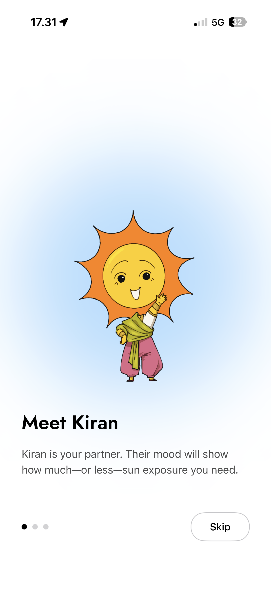
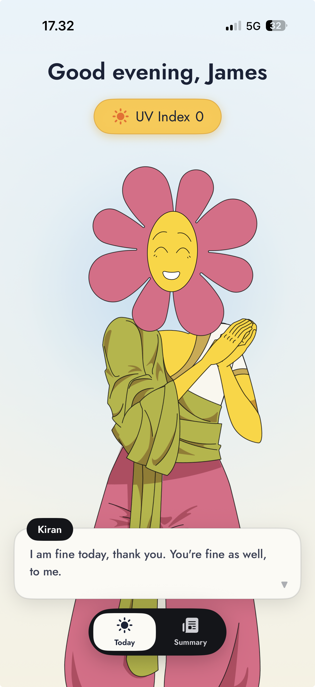
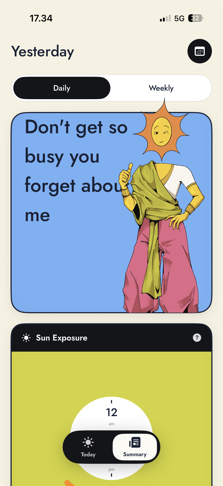
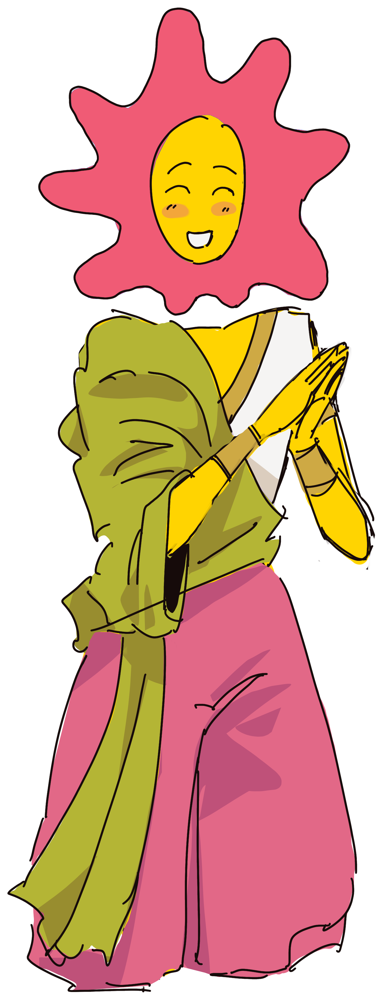
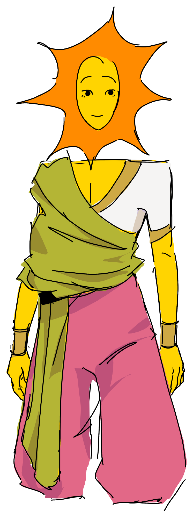
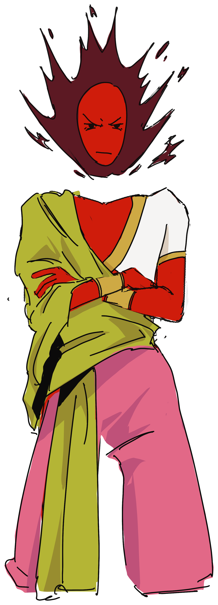

# Date the Sun ☀️

**Date the Sun** is about having a *balanced relationship* with the sun — personified here as **Kiran**, your partner. Just like an actual relationship, it's all about give and take: spend too little time with Kiran and she feels neglected, smother her with too much sun and she'll throw a tantrum. Get the balance right and she's happy.

Under the hood, the app quietly tracks how much UV you actually soak up throughout the day — distinguishing real outdoor exposure from time spent indoors — and turns it into a single daily score. That score is Kiran's mood, so keeping her happy simply means keeping your sun exposure healthy.

> 🧪 **Try it on TestFlight:** https://testflight.apple.com/join/ytvpjj5U

---

## Screenshots

| Onboarding | Today | Summary |
| :---: | :---: | :---: |
|  |  |  |
| Meet Kiran & grant permissions | Live UV, Kiran's mood, and dialogue | Daily & weekly sun-exposure breakdown |

---

## How it works

Date the Sun combines on-device location, motion, and weather data to estimate your **effective UV dose** without needing you to log anything manually.

1. **Indoor / outdoor classification** — A lightweight classifier labels each location sample as `indoor` or `outdoor`. These noisy labels are then smoothed by a **Hidden Markov Model (Viterbi)** that accounts for the fact that people tend to stay in one place rather than flip back and forth, producing a clean posterior probability of being outdoors at any moment.

2. **UV dose calculation** — For each interval, UV exposure is accumulated as:

   ```
   dose += uvIndex × minutesOutdoors × P(outdoor)
   ```

   UV Index values come from **WeatherKit** (via its REST API) for your location.

3. **Sun Score (a.k.a. Kiran Score)** — Your daily dose is mapped to a 0–100 score with a target "healthy" window. Too little sun ramps the score up toward the target; too much sends it back down with a danger penalty for overexposure. Wearing **sunscreen** or **protective clothing** raises your healthy target and reduces effective UV (modeled multiplicatively — SPF 30+ ≈ 65% reduction, UPF fabric ≈ 75%).

4. **Kiran's mood** — The score drives Kiran's mood (`happy` / `neutral` / `angry`), expressed through Lottie animations, corona colors, and a rotating set of in-character dialogue lines.

Everything runs continuously in the background via scheduled **Background Tasks**, so your day is tracked even when the app is closed.

---

## Features

- ☀️ **Automatic sun tracking** — no manual logging; indoor/outdoor inference from location + motion
- 🧠 **HMM-smoothed exposure** — Viterbi decoding turns noisy classifications into reliable outdoor probabilities
- 📊 **Daily & weekly summaries** — sun-exposure cards, weekly exposure charts, indoor/outdoor clock, protection log
- 🧴 **Protection-aware scoring** — sunscreen and protective clothing adjust your effective dose and target
- 🌥️ **Real UV data** — WeatherKit UV Index for your location
- ☀️ **Kiran, your sun partner** — mood-driven character with Lottie animations and personality
- 🔔 **Notifications** — context-aware nudges with a custom notification content extension
- 🔄 **Background processing** — exposure is computed even when the app isn't open

---

## Tech stack

| Area | Details |
| --- | --- |
| Language | Swift 5 |
| UI | SwiftUI |
| Persistence | SwiftData (shared via App Group) |
| Location | CoreLocation |
| Weather / UV | WeatherKit (REST) |
| Background | BackgroundTasks (`BGTaskScheduler`) |
| Animation | [Lottie](https://github.com/airbnb/lottie-ios) |
| Logging | OSLog |
| Min. iOS | 26.0 |

---

## Project structure

```
date-the-sun/
├── date_the_sunApp.swift          # App entry, background task registration
├── DesignSystem/                  # Typography, Palette, color helpers
├── Domain/
│   ├── Models/                    # HMMObservation, DailySunSummary, KiranMood, …
│   └── Services/                  # HMMEngine, UVDose, LocationTracker,
│                                  #   WeatherKit provider, schedulers, notifications
├── Features/
│   ├── Onboarding/                # First-run flow & permissions
│   ├── Today/                     # Live UV + Kiran + dialogue
│   ├── Summary/                   # Daily/weekly breakdowns & charts
│   ├── Root/                      # Root view + floating tab bar
│   ├── Notification/             # Notification response handling
│   └── Debug/                     # Debug sheet & GPX seeding (DEBUG only)
├── Resources/                     # Lottie animations & bundled Jost fonts
└── Assets.xcassets/               # Kiran art, app icon, colors
```

Key files worth a look:

- [HMMEngine.swift](date-the-sun/Domain/Services/HMMEngine.swift) — indoor/outdoor Viterbi smoothing
- [UVDose.swift](date-the-sun/Domain/Services/UVDose.swift) — dose accumulation & Sun Score
- [KiranMood.swift](date-the-sun/Domain/Models/KiranMood.swift) — mood mapping & character dialogue
- [Docs/BackgroundTask.md](date-the-sun/Docs/BackgroundTask.md) — background scheduling notes

---

## Getting started

### Requirements

- **Xcode 26** or later
- **iOS 26.0+** device or simulator
- An Apple Developer account with **WeatherKit** enabled (for live UV data on device)

### Build & run

```bash
git clone <this-repo>
cd date-the-sun
open date-the-sun.xcodeproj
```

Swift Package dependencies (Lottie) resolve automatically on first open. Select a simulator or device and hit **Run** (⌘R).

> **Tip:** `DEBUG` builds preload a week of synthetic exposure data so the Summary screens are populated without waiting for real tracking. A debug sheet (and GPX seeding) is available in debug builds for testing location scenarios.

---

## Permissions used

- **Location** (incl. background) — to detect outdoor time and fetch UV for your area
- **Notifications** — for sun-exposure nudges
- **Background fetch / processing** — to keep your exposure up to date

---

## Meet Kiran

Kiran is the sun, personified as your partner — warm, expressive, and a little dramatic. Built from layered illustration assets and Lottie animations, her corona color and expression shift with your daily Sun Score:

|  |  |  |
| :---: | :---: | :---: |
| **Happy** | **Neutral** | **Angry** |
| You've found a healthy balance. | A little too much or too little sun. | Way off the healthy window — she needs space. |
| _"I'm feeling pretty chill today. Do you want to hang?"_ | _"Don't get so busy you forget about me."_ | _"Easy — I think I need a little space today."_ |
